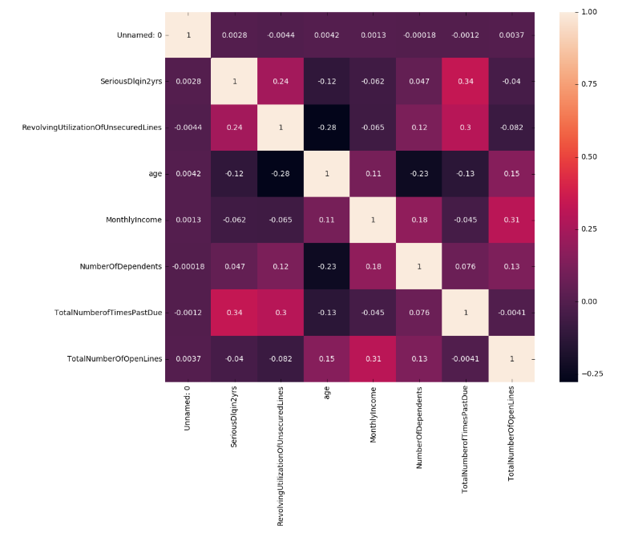

# Credit Scoring Algorithm and Its Implementation in Production Environment :hand: fa18-523-83


| Nhi Tran
| nytran@iu.edu
| Indiana University
| hid: fa18-523-83
| github: [:cloud:](https://github.com/cloudmesh-community/fa18-523-83/blob/master/project-report/report.md)
| code: [:cloud:](https://github.com/cloudmesh-community/fa18-523-83/blob/master/project-code/)


## Abstract


A credit scoring algorithm is essential to help any bank determine whether to 
authorize a loan to consumers. Most of the decisions require fast results and 
high accuracy in order to improve the bank customer satisfaction and profit. 
Choosing a correct machine learning algorithm will result in high accuracy in 
the prediction and a reasonable implementation of the algorithm will result in 
the fast service a bank can provide to its customers.


## Keywords


fa18-523-83, machine learning, predict algorithm, classification, docker, 
deployment, API

 
## Introduction


For every machine learning problem, there are normally two main areas that 
everyone focuses on: which machine learning algorithms to use and how to 
implement and integrate the machine learning code into a new or existing 
production infrastructure.

Most of the time, machines make predictions by learning and observing the data 
patterns from previously existing data with known results. Once the training 
is over, the machine learning code can then be applied to new data and predict 
the unknown results by applying the trained patterns and algorithms.

The next thing to do after prediction would be determining how to retrieve and 
apply the result of the prediction into a new or existing production 
application and how to ensure the continuous deployment into the production 
environment without resulting deployment code defects.

The business problem that will be focused on in this project is how to 
determine in real-time whether or not a customer will be experiencing a 
financial distress in the next two years. By predicting the business problem, 
banking companies can use the results as part of their business rules to 
decide whether to approve their products to the customers. Once the algorithm
is finalized and trained into a model, the deployment of code will be 
performed and benchmarked to provide an overview of how long it will take to 
move, set up and run the code from one environment to another.

## Design


### Dataset

We are utilizing an existing dataset from the 'Give Me Some Credit' competition 
on Kaggle to train and test algorithms and determine which algorithms would be 
the best to predict the probability of someone experiencing financial distress 
in the next two years [@fa18-523-83-www-gmsc-kaggle-competition].

The Kaggle competition contains a training set, a test set, and a data 
dictionary. The training set contains 150,000 records of previous customer 
data with an existing label indicating whether or not each customer had 
serious bank delinquency within two years. The test set contains about 100,000 
records without any label data, which will not be part of the analysis but 
will be used as part of the benchmarking report.
 
Data descriptions [@fa18-523-83-www-gmsc-kaggle-data]:

*  **SeriousDlqin2yrs**: label data, contains 'Yes' or 'No' indicator 
*  **RevolvingUtilizationOfUnsecuredLines**: total balance of unsecured lines 
such as credit cards and personal lines
*  **age**: bank customers' age
*  **NumberOfTime30-59DaysPastDueNotWorse**: number of times each customer has 
been 30-59 days past due but no worse in the last 2 years
*  **DebtRatio**: monthly debt payments divided by monthly gross income
*  **MonthlyIncome**: bank customers' monthly income
*  **NumberOfOpenCreditLinesAndLoans**: number of open loans and lines of credit 
*  **NumberOfTimes90DaysLate**: number of times each customer has been 90 days 
or more past due
*  **NumberRealEstateLoansOrLines**: number of mortgage and real estate loans
*  **NumberOfTime60-89DaysPastDueNotWorse**: number of times each customer has 
been 60-89 days past due but no worse in the last 2 years
*  **NumberOfDependents**: number of dependents in family excluding themselves 
(spouse, children etc.)

### Data Visualization

Using the `describe()` function in Python *pandas* package, the statistics for 
each attribute within training dataset is populated. The statistics include 
count, mean, standard deviation, minimum, quantiles, and maximum. The function 
helps with seeing outliers and identifies values or columns that need to be 
cleaned up. For example, in the training set, some areas that will need to be 
carefully examined are *age* with a minimum value of *0*, *MonthlyIncome* 
and *NumberOfDependents* contains *NaN* value in their quantiles. 

|       |          |               |                    | 
|-------|----------|---------------|--------------------| 
|       | age      | MonthlyIncome | NumberOfDependents | 
| count | 150000.0 | 120269.0      | 146076.0           | 
| mean  | 52.29520 | 6670.22123739 | 0.7572222678605657 | 
| std   | 14.77186 | 14384.6742152 | 1.1150860714872997 | 
| min   | 0.0      | 0.0           | 0.0                | 
| 25%   | 41.0     | NaN           | NaN                | 
| 50%   | 52.0     | NaN           | NaN                | 
| 75%   | 63.0     | NaN           | NaN                | 
| max   | 109.0    | 3008750.0     | 20.0               | 


Data Visualization in Python can be done using graphing packages such as 
*matplotlib*, *seaborn*, etc.

Using *matplotlib*, +@fig:agecounttraining shows that there is a small count 
of *0* value as outliers and the distribution without those outliers will be 
a right-skewed distribution. Therefore, it is better to replace those outliers 
with the median value of the distribution.

{#fig:agecounttraining}

+@fig:attributescounttraining shows overall distribution of the count of 
customers that experienced past due, the count of customers that have open 
credit and real estate lines, and the count of customers that have dependents 
other than themselves. Most of the distributions are right-skewed, the majority 
of them do not have any past due or dependents.

{#fig:attributescounttraining}


+@fig:labeldistribution shows the distribution of the label that will be what 
the machines are trying to predict. If the label distribution is not even, the 
model might overfit and give a higher chance of predicting the label that has 
a higher population. In this case, the amount of customers that had no 
delinquency is 14 times more than the number of customers that had delinquency. 
This issue will need to be handled during the *Data Cleaning* or 
*Model Training* process to avoid overfitting.

{#fig:labeldistribution}


### Data Preperation
 
From the *Data Visualization* step, the first basic data preparation is 
replacing missing value with median value. Another way to handle this issue is 
to drop records that have missing data, however, due to low data volumes and 
mbalanced class data distribution, it is better to replace missing data instead. 

Using *seaborn*, *heatmap* can be used to visualize the correlation of all 
attributes. Correlation is a measurement of the strength of association between 
two variables and the relationship's direction 
[@fa18-523-83-www-correlation-stats]. Correlation is an important indicator 
in the Feature Selection process to help determine which attributes should be 
used as part of the training set and which attributes should be irrelevant. 
There are multiple correlation methods to calculate the correlation 
coefficient, the method that is used for this training set is called 
*Spearman*. +@fig:correlation1 shows the first observation of the 
correlation between all variables.

{#fig:correlation1}


From +@fig:correlation1, *DebtRatio* has a very low correlation to the class 
label. It means that the debt ratio of a customer does not impact whether a 
customer will be likely to default in the next 2 years. At the same time, 
the *DebtRatio* variable is highly correlated with the number of open credit 
lines and real estate loans, which could potentially interrupt the training 
algorithms and result in a false prediction. Therefore, it is better to 
exclude *DebtRatio* out of the final dataset.

Another observation from +fig:correlation1 is that all number of past due 
variables have a high impact on the class label and between themselves at 
the same time. Since they are all past due type of data, adding them all into 
a new variable called *TotalNumberOfPastDue* and dropping all individual past 
due variables could be a good idea to avoid conflict between those variables. 

Similar to past due variables, *NumberOfOpenCreditLinesAndLoans* and 
*NumberOfRealEstatesLoansOrLines* are highly correlated to each other, 
therefore, adding them together into a new variable called 
*TotalNumberOfOpenLines* is a way to solve the problem. 

Once all of the new variables are added and individual variables are removed, 
it is good to run the *heatmap* again to determine whether or not there is 
more cleaning to be done. +@fig:correlation2 is the second *heatmap* run with 
all prepared variables.


{#fig:correlation2}


The final observation is that *MonthlyIncome* and the new variables 
*TotalNumberOfOpenLines* are also highly correlated to each other. Since 
*MonthlyIncome* has a higher correlation than *TotalNumberOfOpenLines*, the 
last step to have a final training dataset is to drop *TotalNumberOfOpenLines*.

### Model Training

Because the training data has imbalanced classes, there are multiple 
ways to handle this issue:

Methods that will be used [@fa18-523-18-www-imbalanced-classes]: 

* **Changing Performance Metric**: instead of using only *Accuracy* as the main 
performance metric to evaluate models, try to include other metrics such 
as *Confusion Matrix*, *Precision*, *Recall*, *F1 Score*, *Kappa*, *ROC Curves*. 
      
* **Resample Dataset**: add copied of instances from low volume class as an 
over-sampling method, or delete instances from high volume class as 
an under-sampling method, or re-run the algorithm on shuffled data 
(k-fold cross-validation). Under-sampling and cross-validation are used as 
part of the training process for this problem and will be included as part 
of the result evaluation section.
      
* **Different Algorithms**: run data on multiple algorithms and evaluate and 
choose the best algorithms that fit the provided data.
      
* **Penalized Models**: Use penalized methods to cause the model to pay more 
attention to the minority class to evaluate.
      
Methods that will not be used [@fa18-523-18-www-imbalanced-classes]: 

* **Increase Training Data**: gaining more data to provide more balance and 
insights in data. 
      
* **Generate Synthetic Samples**: use popular algorithms such as Synthetic 
Minority Over-sampling Technique to generate synthetic data. 

 
The goal is to determine whether someone will experience financial distress 
in the next two years, therefore, there will only be two values in the label. 
With a binary classification problem on supervised data, it is best to use 
classification algorithms such as Random Forest, Logistic regression, XGBoost, 
Support Vector Machine, Neural Network, and Support Vector Machine.

* **Random Forest**: an ensemble of Decision Tree algorithm, builds and merge 
multiple decision trees together to get average results for prediction 
[@fa18-523-83-www-random-forest] . Using Python, the algorithm can be used 
from *RandomForest()* function in *sklearn* package. 

* **Logistic Regression**: uses an equation with weights for coefficient values 
of input values to make a prediction. For Binary Logistic Regression, a 
threshold between 0 and 1 is needed to determine the category of the prediction 
[@fa18-523-83-www-logistic-regression]. This algorithm is 
*LogisticRegression()* function in *sklearn* package. 

* **XGBoost**: xgboost is

> "a scalable and accurate implementation of gradient boosting machines and it 
> has proven to push the limits of computing power for boosted trees algorithms 
> as it was built and developed for the sole purpose of model performance and 
> computational speed" [@fa18-523-83-www-xgboost-kdnuggets]. 

There is an XGBoost API that can be called via *sklearn* using function 
*XGBClassier*.

* **Neural Network**: a neural network is a machine learning algorithm that 
is inspired by the human brain. Neural network identifies the pattern of input 
data through multiple layers of artificial neural layers 
[@fa18-523-83-www-neural-network]. The function *MLPClassifier* from 
*sklearn* is one of the Neural Network algorithms for classification problem.

* **Support Vector Machine**: an algorithm that finds patterns and predicts 
output data by finding hyperplane(s) in an N-dimensional space 
fa18-523-83-www-svm]. The function *LinearSVC* from *sklearn* is one of the 
Support Vector Machine algorithms for classification problem.

### Result Comparison

There are two sets of run that were evaluated in the provided dataset: normal 
run and balanced run. On a normal run, due to imbalanced data distribution, 
it is important to compare metrics for algorithms with defaulted parameters 
and algorithms with penalized configured parameters.

In order to evaluate and determine which algorithms to use, it is important 
to understand what each metric mean and what the expectation of each metric is. 
In the evaluation, there are five metrics that will be used to compare between 
models [@fa18-523-83-www-metrics-evaluate]: 

* **Classification Accuracy**: the ratio between correct prediction over the 
total sample sizes. It only works well if we have a balanced class label 
distribution.

* **Area Under Curve (AUC)**: often used for binary classification problem. 
AUC measures the area under the curve of False Positive Rate vs True Positive 
Rate plot. AUC ranges from 0 to 1 and a higher AUC indicates a better-performed 
model.

* **Precision**: the number of correct positive results divided by the number 
of positive results predicted. Precision indicates how many instances that were 
predicted correctly.

* **Recall**: the number of correct positive results divided by the number of 
records that should have been identified as positive. Recall indicates how 
much data was misclassified.

* **F1 Score**: the F1 score is the balance between precision and recall, a 
better model gives a higher F1 score.

The metrics for all models are being performed by `cross_validation()` function 
in *sklearn* with a parameter of `cv=10` to allow the data to be re-shuffled 
and re-validated ten times. It is to ensure a high-quality result and optimize 
the data volume. The results are the average of all ten runs. 

|                 | LR   | LR Pnlzd | RF   | LSVC  | LSVC Pnlzd | XGBoost | XGBoost Pnlzd | MLPClassifier | MLPClassifier Pnlzd | 
|-----------------|------|----------|------|-------|------------|---------|---------------|---------------|---------------------| 
| fit_time        | 0.64 | 0.43     | 2.50 | 32.10 | 31.87      | 5.34    | 5.10          | 36.90         | 12.13               | 
| score_time      | 0.03 | 0.02     | 0.26 | 0.02  | 0.02       | 0.35    | 0.30          | 0.28          | 0.17                | 
| test_f1         | 0.00 | 0.00     | 0.11 | 0.01  | 0.01       | 0.03    | 0.00          | 0.05          | 0.00                | 
| train_f1        | 0.00 | 0.00     | 0.86 | 0.01  | 0.01       | 0.03    | 0.00          | 0.05          | 0.00                | 
| test_accuracy   | 0.93 | 0.93     | 0.93 | 0.87  | 0.93       | 0.93    | 0.93          | 0.88          | 0.93                | 
| train_accuracy  | 0.93 | 0.93     | 0.98 | 0.87  | 0.93       | 0.93    | 0.93          | 0.88          | 0.93                | 
| test_recall     | 0.00 | 0.00     | 0.07 | 0.06  | 0.00       | 0.01    | 0.00          | 0.11          | 0.00                | 
| train_recall    | 0.00 | 0.00     | 0.77 | 0.06  | 0.00       | 0.02    | 0.00          | 0.11          | 0.00                | 
| test_precision  | 0.00 | 0.00     | 0.27 | 0.06  | 0.07       | 0.49    | 0.20          | 0.10          | 0.00                | 
| train_precision | 0.00 | 0.00     | 0.99 | 0.04  | 0.05       | 0.60    | 0.25          | 0.31          | 0.01                | 
| test_roc_auc    | 0.64 | 0.58     | 0.68 | 0.59  | 0.58       | 0.80    | 0.79          | 0.64          | 0.54                | 
| train_roc_auc   | 0.64 | 0.58     | 1.00 | 0.58  | 0.58       | 0.80    | 0.80          | 0.64          | 0.54                | 


*Accuracy* will not be a relevant metric to determine the performance of each 
model. It is included to emphasize a point that a model can provide a really 
high accuracy but can still perform poorly. In term of *F1 Score*, 
*Random Forest* seems to perform well comparing to the rest of the models. 
In term of *AUC*, *Random Forest* has a high *AUC* value in training dataset 
and a lower *AUC* value in test dataset whereas *XGBoost* performed 
consistently in both train and test run.

The same algorithms will be applied to the balanced dataset. *Sklearn* has a 
function that allows data to be shuffled with a specification of how many 
samples are needed for each label to ensure a result of the balanced-label 
dataset. This evaluation will not require penalized algorithms.


|                 | LR        | Random Forest | XGBoost | MLPClassifier | Linear SVC | 
|-----------------|-----------|---------------|---------|---------------|------------| 
| fit_time        | 0.16      | 0.34          | 0.66    | 1.61          | 1.59       | 
| score_time      | 0.02      | 0.06          | 0.06    | 0.02          | 0.01       | 
| test_f1         | 0.61      | 0.66          | 0.72    | 0.51          | 0.26       | 
| train_f1        | 0.61      | 0.97          | 0.73    | 0.51          | 0.26       | 
| test_accuracy   | 0.60      | 0.68          | 0.73    | 0.55          | 0.50       | 
| train_accuracy  | 0.60      | 0.97          | 0.73    | 0.55          | 0.50       | 
| test_recall     | 0.61      | 0.63          | 0.72    | 0.58          | 0.36       | 
| train_recall    | 0.61      | 0.96          | 0.73    | 0.59          | 0.36       | 
| test_precision  | 0.60      | 0.70          | 0.73    | 0.59          | 0.40       | 
| train_precision | 0.60      | 0.98          | 0.74    | 0.60          | 0.47       | 
| test_roc_auc    | 0.64      | 0.74          | 0.79    | 0.59          | 0.55       | 
| train_roc_auc   | 0.64      | 1.00          | 0.80    | 0.60          | 0.56       | 

*Accuracy* is now an important factor to determine how well a model performed. 
In this case, *XGBoost* has the highest accuracy out of all models as well as a 
high and consistent *AUC* value. *Random Forest* also returns a great result 
but seems to be inconsistent due to its higher result in train data comparing 
to test data.

After both comparisons, *XGBoost* is the model that yields high and consistent 
performance. The *XGBoost* model on balanced dataset will be saved and used in 
the credit score application to predict the banking credit problem we are 
trying to solve.

## Implementation


### Technologies Used

#### Versions

#### Kaggle API

Kaggle API provides the ability to pull and push data from Kaggle website using 
command tool implemented in Python 3. The Kaggle API GitHub page provide 
detailed Installation, API credentials and commands instruction 
[@fa18-523-83-www-kaggle-api-github]. 

#### Python and Python Packages

* **click**: allows arguments to be passed to python code.

* **sklearn**: contains off-the-shelf machine learning algorithms packages with 
evaluation/report functions to cross-validation, shuffle data, and report 
metrics

* **xgboost**: contains xgboost algorithm  

* **pandas**: allows easy-to-use abilities to read, process, slice, write 
and store data via dataframe and pickle

* **flask**: allows the ability to run and process APIs via web services 
via Python

#### Flask API

Flask API is a Python package that allows RESTful web service from Python. 

#### Docker

Docker creates containers that are standalone images that bundle all 
dependent configuration files, packages, tools, libraries, and applications. 
A user can run any application through images without having to worry about 
the rest of the dependent components.

#### AWS EC2

AWS EC2 provides cloud services to host server, run and deploy the code.

### Prerequisites

In order the run the code and reproduce the run, the following prerequisites 
need to be met:

* **Ubuntu 18.04 Bionic Beaver or 18.10 Cosmic Cuttlefish Server**: all codes 
were tested on Ubuntu 18.04 and 18.10 Server

* **Kaggle Account**: a Kaggle account is required to pull data from Kaggle.

* **Kaggle API Credentials File**: after the Kaggle account is created, go to 
the *Account* tab of user profile and select *Create API Token* to generate 
and download `kaggle.json` and save as `kaggle.json` at `~/.kaggle` directory 
and set the permission to 600  [@fa18-523-83-www-kaggle-api-github]. 

* **Make**: ensure that *make* is installed. If not, use the following 
command to install *make*:

    ```
    sudo apt-get install make
    ```
    
  This will allow the *make* command from *Makefile* to be run. The rest 
  of the prerequisites packages and software can be run using *make* command.

* **Project's Git Command**: install git command by running the following 
command:

    ```
    sudo apt-get install git-core
    ```

* **Project's Github Repository Cloned**: ensure all project is cloned from 
GitHub using the following command:

    ```
    sudo git clone https://github.com/cloudmesh-community/fa18-523-83.git
    ```

* **AWS Account** : an AWS account is required to be able to launch a cloud 
server instance for deployment and benchmarking results. The AWS account can 
be created via the AWS EC2 page [@fa18-523-83-www-aws-ec2]. Credit card 
information is required during registration but the server instance can be 
launched for free.

* **Setting up EC2 Server Instance**: once the AWS is created, AWS EC2 
instances can be created. Once logged in, the user can *Launce Instance* 
with the following configurations [@fa18-523-83-www-aws-ec2]:

     *  Step 1: Choose an Amazon Machine Image (AMI) Cancel and Exit: 
	 select *Ubuntu Server 18.04 LTS (HVM), SSD Volume Type*
     *  Step 2: Choose an Instance Type: default to free tier option
     *  Step 3: Configure Instance Details: use all default options 
     *  Step 4: Add Storage: use all default options 
     *  Step 5: Add Tags: use all default options 
     *  Step 6: Configure Security Group: allow SSH (Port 22) and HTTPS 
	 (Port 443) with Source *0.0.0.0/0* and *::/0*
     *  Step 7: Review Instance Launch: after hitting launce, make sure to 
	 choose an existing or create a new key pair and download the key. This 
	 will be the only time user can download a key pair. Ensure the key 
	 permission is 400. 
 
    To connect to AWS EC2 server, run the following command:

    ```
    ssh -i <key-file-and-directory> ubuntu@<AWS-public-DNS>
    ```     

### Project Code Structure and Components

The directory structure of the project are:

```
tree command
```

#### LICENSE

LICENSE file indicates which licensing the project and its code are under. 
In this case, it is MIT license.

#### README

README file provides a short description of the project and code components 
and instruction on how to run the code.

#### Makefile

Makefile contains a list of shortcut commands that can easily run via a 
*make* command when the user is in the directory where the Makefile is.

#### Dockerfile

This file contains the instruction and components to build the docker image. 
The file content is:

```
FROM python:3.6

WORKDIR /app

COPY . /app


RUN pip install --trusted-host pypi.python.org -r requirements.txt

EXPOSE 80 

CMD python ./app.py
```

Dockerfile includes six major steps: FROM, WORKDIR, COPY, RUN, EXPOSE, CMD. 
The steps instruct docker to know which programming language and version to 
use, temporary working directory, package dependencies, port to use, and the 
python main script to run.

#### requirements.txt

This file contains all the necessary packages to be part of building the 
docker image.

The four packages that are required for Flask API app are:

```
flask
sklearn
xgboost
pandas
```

#### app.py

app.py is the main app that utilizes flask API to take JSON file data from 
API *POST* command and apply the machine learning model to output prediction 
into a JSON file. 

#### Other python codes

* preprocessing.py: python code that reads raw data and cleans the data 
into a good form to feed into machine learning algorithms
* to_json.py: python code to convert file from dataframe format to JSON format
* train_data.py: python code to train and build XGBoost model and output the 
model for the credit flask API app
* evaluation.py: python code to evaluate multiple algorithms and output results 
into CSV files

### Code Running Instruction

#### Environment and Files Preparation

After all the prerequisites are met and the Ubuntu server is up and running, 
the follow steps can be used to reproduce the environment and files preparation 
process starting at the directory that the *Makefile* is in:

Step 1: Environment preparation

```
make prepare-environment
```

Step 2: Download data files from Kaggle

```
make download-file
```

Step 3: Prepare Train and Test files:

```
make prepare-files
```

or run the one-step *make* command:

```
make prep-all
```

#### Analysis

```
make evaluation
```

#### Deployment

Step 1: Build a docker image

```
make docker-build-image
```

Step 2: Run docker image

```
make docker-run-image
```

#### Test Run Application

POST JSON test data to API Flask app

In a new terminal, run the following command:

```
make post-test-data
```

The result JSON file should be located in `data/processed/result.json`.


#### Clean Up

The following command to clean up files after the deployment:

```
make clean
```

To stop docker service, run:

```
docker stop
```

## Results

### Deployment Benchmarks


### Application Benchmarks


## Limitations

Data volume is limited due to the provided dataset is from a Kaggle 
competition; increasing in data volume would improve the prediction result. 

Prediction results could also be improved by running and evaluating 
more other classification algorithms. Also, parameters can be enhanced 
to provide more customization to all algorithms to observe this specific 
pattern of the training set.

In term of network and security, the project does not focus on security and 
authentication/authorization aspect of the code, most of the port and 
network are set to allow any IP access to the EC2 server. 

## Conclusion


## Acknowledgements

The author would like to thank professor Lakowski and his class's TAs for 
helping with materials, markdown writing techniques, and review of this project.
 
## References
